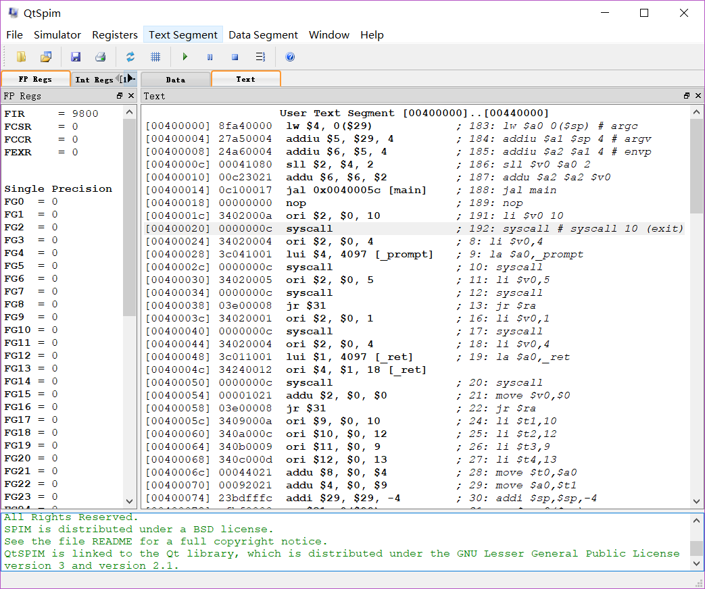

# CComplier
## 基于MIPS汇编的C语言编译器
- ### Lex Yacc C++ 实现
> ##### 进入项目根目录
>> ```cd ccompiler```
> ##### 在Windows环境下执行4YuanFormual.exe，该程序为```./4YuanFormula/```目录下vs2015生成的exe可执行文件的链接
>> ```./4YuanFormual.exe.ink```
> ##### 程序会从```./input.c```中读入C源文件并在控制台进行`错误处理`与`类型检查`，并将生成的四元式输出到```./4yuan.txt```
> ##### 接着执行```./trans4toCode.py```读取四元式并将中间代码输入到```./innerCode.txt```中
>> ```python ./trans4toCode.py```
>
> 变量消减的代码优化为可选项，建议在即有示例代码```./input.c```上尝试，其余输入情况下发生故障本项目组具有完全解释权
>> ```python ./optimize.py```
> ##### 最终执行```objectcode.py```将中间代码转为MIPS汇编到```result.asm```中
>> ```python ./objectcode.py```
> ##### 打开```./QtSpim/QtSpim.exe```，导入```result.asm```汇编即可执行！
> 
> 
>
> 另：生成四元式后，可一键自动生成MIPS汇编，因为此脚本集成了代码优化，所以不是很推荐
>> ```python mips.py```
- ### Java CC 实现

## 纯手工实现的词法分析器，以@为命令可以实现从文件读取，从标准输入读取，连续编译和不连续编译（主要区别是变量空间不同）

---

# JavaCC

## 使用 JavaCC 实现简单的加法示例

## 使用 JavaCC 进行语法分析并建立语法树

---

# CCompiler

实现了一个简单的 C 编译器，可以进行词法分析、语法分析、语义分析、类型检查并最终生成中间代码——四元式。

## tree 包

实现了 Node 类，用于保存每个节点的属性并建立语法树。

最重要的三个属性是 Type，Value 和 StyleId（从 Node 开始的中间代码的 Id）。

## table 包

实现了 SymbolTable（符号表）类，静态使用，可以压栈符号表，出栈符号表，用于表示不同的命名空间，可以递归查询是否声明变量，也可以非递归查询检测同一命名空间中是否变量重名。

当一个变量被声明后再次使用的时候会从符号表中取出之前存储的属性，主要是 Type 用于类型检查，SymbolTable 和符号表项 Entry 类与 Node 类是松耦合的，可以通过 getNode_r 联系到一起。

## exception 包

- 编译错误
- 类型不匹配错误
- 标识符重定义错误
- 标识符未定义错误

## abstractcode 包

实现了 FourTermStyle 类，静态添加四元式并注册顺序 ID，newTemp（） 可以生成临时变量，可以实现跳转语句的回填。

- ### 特性&特点
